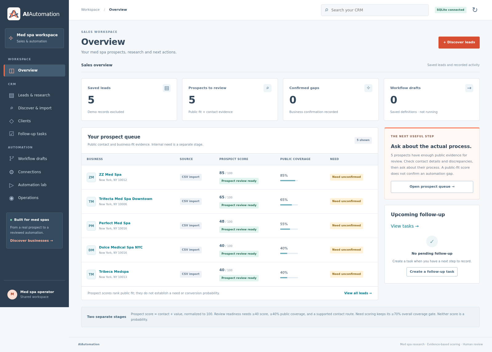

# Med Spa Automation Platform

An additive [Next.js pilot workspace](frontend/README.md) now provides a purple dashboard, CSV discovery/import, lead research, Gemini draft panels, read-only AI chat, workflow graphs and sandbox reminder controls. The original `/app/` CRM remains available. Google Stitch is configured as optional Codex design tooling; see [Stitch setup](docs/STITCH-SETUP.md). Neither provider has been verified live in this change.

Browser workspace and backend MVP for finding med spas, assessing automation opportunities, preparing
outreach, generating workflow definitions, running reminders and preparing client
handoff. It includes contact history/tasks, reviewed client workflow activation,
operations monitoring and local persistence, with adapters for Google Places,
OpenAI, Supabase, Resend email and human Twilio calling.
Live provider access requires configuration and separate verification.
For a short explanation of the purpose, usage and limits, read
[PROJECT-EXPLAINED.md](PROJECT-EXPLAINED.md).

See [the shared-workspace MVP contracts and demo](backend/MVP.md) and
[the backend status audit](backend/STATUS.md) for what works, the problems
corrected, verification evidence, and execution/delivery work still remaining.
For the new client, follow-up task and operations screens, use
[the browser walkthrough](backend/WORKSPACE.md).
The [backend handoff](backend/HANDOFF.md) defines the completed hackathon scope,
faults corrected and requirements for live integrations.
The workspace now uses a [HubSpot-inspired CRM layout](backend/CRM_DESIGN.md)
with local search, saved lead views and record details connected to those APIs.



This screenshot shows the verified cloud workspace with five real leads whose
internal needs remain unconfirmed. A new laptop starts with an empty database;
follow [the Windows guide](WINDOWS-START-HERE.md) to create a labeled demo.

Free discovery uses a local browser pilot and CSV imports. On Windows, the pilot
uses installed Edge and pinned Playwright Core; the portable container keeps its
pinned browser. The collector retains source pages and requires preview before
import. Five live New York medical-spa
listings have been collected and imported. See [backend/SCRAPING.md](backend/SCRAPING.md) for setup,
browser-extension alternatives, upload instructions, and live collection status.
All five official pilot websites now pass automatic website fetching and analysis
through the API. Source evidence and operator-reviewed findings are retained.
Their internal processes remain unknown. See
[backend/API.md](backend/API.md) for website/DNS configuration and current limits.

## Setup

For a Windows laptop, follow [WINDOWS-START-HERE.md](WINDOWS-START-HERE.md).
After installing Python 3.12, double-click `START-WINDOWS.bat` to install the
runtime dependencies and start the local CRM. The download starts with a fresh
local database; the guide includes an explicitly fictional browser walkthrough.

Use Python 3.12. Run these commands from the repository root:

```bash
python3.12 -m venv .venv
.venv/bin/python -m pip install --no-cache-dir -r backend/requirements-dev.txt
.venv/bin/python -m pip check
```

For runtime dependencies only, install `backend/requirements.txt` instead.
The local demo needs no credentials; SQLite storage defaults to ignored
`.local/backend.sqlite3`. No external service is needed for the demo.

## Run

From the repository root:

```bash
.venv/bin/python -m uvicorn app.main:app --app-dir backend --host 127.0.0.1 --port 8000 --workers 1
```

For local development with automatic reload, append `--reload --reload-dir backend/app`.
The browser workspace is served at `/app/` by this same server; `/` redirects there.
Its HTML/CSS/JavaScript is local and requires no npm install or separate frontend server.
Use one API worker. Browser pilots use a process-local concurrency guard; this is
not a distributed job queue. Graceful shutdown waits for an active pilot's bounded
collector to finish and clean up its container. An interrupted job is marked on restart.
Stop the server with Ctrl+C.
Live processes must restart in restored cloud tasks.

## Verify

With the server running:

```bash
curl --fail http://127.0.0.1:8000/health
curl --fail http://127.0.0.1:8000/ready
curl --fail http://127.0.0.1:8000/docs
curl --fail http://127.0.0.1:8000/openapi.json
```

The health response must be `{"status":"ok"}`. `/docs` serves Swagger UI;
its JavaScript and CSS load from `cdn.jsdelivr.net`. `/openapi.json` documents `/health`.
These are local validation addresses; this setup does not publish the application.

## Tests

Run from `backend/`:

```bash
../.venv/bin/python -m unittest discover -s tests -v
```

Tests cover health, documentation, mock search, input validation, and OpenAPI contracts.
They also exercise persistence across app restarts, evidence scoring, ranking,
workflow generation, authentication, website restrictions, provider contracts,
and call idempotency. Provider tests use simulated responses, never real calls.
The v0.10 release suite contained 170 tests. The latest Windows hardening pass
ran 172 tests together and one additional entrypoint test separately; see
[backend/VERIFICATION.md](backend/VERIFICATION.md). Fixtures and live checks are separate.

## Browser workspace

- Overview uses saved data; fictional demo records are excluded by default.
- Leads display source, evidence score, assessed coverage, dates, and unknowns.
  Record supported observations to recalculate. Operational gaps require business confirmation.
- Prospect ranking uses contact + business value, normalized to 100. Review readiness
  requires at least 40 score, 40% public coverage, and a recorded supported contact route.
  These are initial heuristics, not conversion probabilities. Need confirmation is a
  separate stage; its original formula and 70% overall evidence gate are preserved.
- Discover starts a real 1–10-listing pilot, shows saved status, and requires
  preview followed by explicit import. Docker, certutil, the pinned image, and
  network access described in SCRAPING.md are required for browser collection.
- CSV imports preview mapping, row errors, duplicates, and new leads before saving.
- Contact notes track actual outcomes. Without confirmed internal gaps, outreach
  drafts ask about processes rather than claim a problem. Do-not-contact leads are
  excluded from default prospect ranking and cannot generate outreach or workflow drafts.
  Outreach remains downloadable, with no send action.
- Workflow definitions can be created, downloaded, and archived. Saving a draft
  does not start a run. Automation lab now schedules sandbox appointment reminders,
  shows history/unsent previews, and cancels pending work. Its explicit fictional
  demo keeps real leads separate. The guarded email channel is API-only and has
  simulated verification; live credentials and callbacks remain unverified.
  See [the hackathon walkthrough](backend/HACKATHON.md).
- Connections distinguishes configuration presence from verified live operation.
- Clients records authorization and timezone, creates sandbox setups, shows fresh
  readiness separately from saved validation, and supports reviewed activation,
  pause, managed reminders and authenticated handoff downloads.
- Follow-up tasks records manual work and completion/cancellation. Operations
  shows saved counts and bounded alerts, excluding fictional records by default.
  Lead details include recorded contact/task activity; these records cannot
  establish an internal need or provider delivery.

If `APP_API_TOKEN` is set, the workspace asks for it. The token remains in memory
only and is cleared on lock/reload. This is shared MVP access, not individual accounts.
Website refresh recomputes tagged automatic observations and retains operator or
legacy evidence with its original dates; review whether it is still valid.
Evidence edits create a new immutable analysis and
do not fetch another website; the last fetched snapshot is shown with its own date.

## Complete fictional demo

With the server running, from the repository root:

```bash
.venv/bin/python backend/demo.py
```

This exercises import → analyze → rank → outreach draft → contact record →
workflow generation/export. Businesses and evidence are fictional. No messages,
calls, or automation executions occur. Repeating it reuses the businesses and
creates new analysis/workflow snapshots. Use local SQLite, not shared Supabase storage.

## Complete fictional client handoff

```bash
.venv/bin/python backend/client_demo.py
```

This explicitly writes fictional records to a local SQLite API. It exercises CRM
history/tasks, client onboarding, sandbox proof, reviewed activation, a managed
appointment reminder, handoff and monitoring. Repeating it reuses the client and
deployment. Messages remain unsent. Use an isolated database for verification.
See [MVP.md](backend/MVP.md) for contracts and remaining live-provider requirements.

## Mock med spa search

```bash
curl --fail http://127.0.0.1:8000/businesses/search \
  -H 'Content-Type: application/json' \
  -d '{"industry":"med spa","location":"Islamabad"}'
```

The response is an array of two fictional businesses with these fields:

```json
{
  "name": "Demo Glow Med Spa (Mock)",
  "website": "https://example.com/demo-glow-med-spa",
  "phone": null,
  "address": "Mock address, Islamabad",
  "rating": 4.5,
  "review_count": 120
}
```

Names, addresses, ratings, and review counts are mock fixtures. Missing details
are `null`; the example website is a placeholder. No real discovery or geographic
filtering occurs. The supplied location labels mock addresses only.

Supported industries are `med spa`, `med spas`, `medspa`, and `medspas`, ignoring
case and surrounding whitespace. Other nonempty industries return `[]`.
Both request fields are required nonempty strings, trimmed before validation.
Industry is limited to 100 characters and location to 200. Invalid requests return HTTP 422.

For real discovery, use `source=google_places`; `limit` defaults to 10 and supports 1–20.

## API overview

| Purpose | Routes |
|---|---|
| Discovery | `POST /businesses/search`, `POST /businesses/import` |
| Free scraper exports | `POST /businesses/import-csv` (preview by default) |
| Free browser pilots | `POST` / `GET /discovery/jobs`, `GET /discovery/jobs/{id}`, `POST /discovery/jobs/{id}/preview`, `POST /discovery/jobs/{id}/import`, `GET /discovery/jobs/{id}/csv` |
| Contact history and tasks | `POST` / `GET /businesses/{id}/activities`, `POST /businesses/{id}/tasks`, `GET /tasks`, `GET` / `PATCH /tasks/{id}` |
| Clients and handoff | `POST` / `GET /clients`, `GET /clients/{id}`, `POST /clients/{id}/activate`, `/pause`, `/archive`, `GET /clients/{id}/handoff`, `/history` |
| Reviewed workflow activation | `POST /clients/{id}/deployments`, `GET /deployments`, `GET /deployments/{id}/preflight`, `POST /deployments/{id}/validate`, `/activate`, `/pause`, `/archive`, `/runs`, `/appointments` |
| Operations and call outcomes | `GET /operations/summary`, `GET /calls/{id}`, `POST /calls/{id}/reconcile`, `POST /webhooks/twilio/calls/{id}` |
| Appointment events | `POST` / `GET /appointments`, `GET /appointments/{id}`, `POST /appointments/{id}/cancel` |
| Reminder execution | `POST /workflows/{id}/runs`, `GET /workflow-runs`, `GET /workflow-runs/{id}`, `POST /workflow-runs/{id}/cancel`, `GET /workflow-outbox` |
| Email evidence and opt-out | `POST /webhooks/resend`, `POST /workflow-outbox/{id}/reconcile`, `POST /businesses/{id}/automation-contacts/{contact_id}/opt-out` |
| Saved businesses | `POST /businesses`, `GET /businesses`, `GET /businesses/{id}` |
| Analysis | `POST /businesses/{id}/analyze`, `GET /analyses`, `GET /analyses/{id}` |
| Ranked opportunities | `GET /opportunities` |
| Public prospects / stages | `GET /prospects`, `GET /businesses/{id}/qualification` |
| Outreach draft | `GET /businesses/{id}/outreach-draft?analysis_id=...` |
| Contact stage | `GET` / `PATCH /businesses/{id}/contact` |
| Workflow definitions | `POST` / `GET /workflows`, `GET /workflows/{id}`, `GET /workflows/{id}/export`, `POST /workflows/{id}/archive` |
| Sandbox execution | `POST /workflows/{id}/runs`, `GET /workflow-runs`, `GET /workflow-runs/{id}`, `POST /workflow-runs/{id}/cancel`, `GET /workflow-outbox` |
| Human calling | `POST /businesses/{id}/calls`, `GET /calls` |
| Configuration presence | `GET /capabilities` |

See [backend/API.md](backend/API.md) for analysis requests, scoring, and integration setup.

## Configuration and persistence

`.env.example` lists names only. The app does not automatically load `.env`;
use environment settings or exported shell variables and restart the server after changes.
Never commit credential values.

| Variable | Purpose / default |
|---|---|
| `APP_ENV`, `APP_ALLOWED_HOSTS` | Development by default; production requires explicit app hostnames |
| `APP_API_TOKEN` | Shared API bearer token; required before public exposure or enabling calls |
| `BROWSER_RUNTIME`, `SCRAPE_OUTPUT_DIR` | Docker collector and ignored local output in development; bundled local collector and `/data/scrapes` in the release image |
| `PERSISTENCE_BACKEND` | `sqlite` (default) or `supabase` |
| `APP_DB_PATH` | Defaults to `.local/backend.sqlite3` at repository root |
| `GOOGLE_PLACES_API_KEY` | Places API (New) credentials for real discovery |
| `LLM_API_KEY`, `LLM_MODEL` | Optional AI summary; default model `gpt-4.1-mini` |
| `WEBSITE_ALLOWED_HOSTS` | Comma-separated exact trusted public hostnames; empty by default |
| `SUPABASE_URL`, `SUPABASE_KEY` | HTTPS project URL and backend service-role key |
| `ENABLE_OUTBOUND_CALLS` | Defaults to `false` |
| `TWILIO_ACCOUNT_SID`, `TWILIO_AUTH_TOKEN` | Human calling provider credentials |
| `TWILIO_FROM_NUMBER`, `SALES_AGENT_NUMBER` | Provider-authorized caller ID and your sales agent number |

When `APP_API_TOKEN` is set, data routes require `Authorization: Bearer <token>`.
In development, use the Authorize button in `/docs`. Health stays public;
production disables API documentation and requires a token of at least 32
printable non-space characters plus explicit app hosts.
This is shared development/MVP access control, not multi-user authentication.
Keep loopback binding until deployment infrastructure and access control are configured.

See [deploy/README.md](deploy/README.md) for the portable image, isolated deployment
verification, persistent storage, and production hosting settings. The image runs
the live collector inside the app container, without a Docker socket. Hosting and
HTTPS publication remain separate from local container verification.

SQLite persists across server restarts. To use Supabase, run
[backend/supabase.sql](backend/supabase.sql), configure credentials and network access,
select `PERSISTENCE_BACKEND=supabase`, restart, and check `/ready`. RLS denies
anonymous/authenticated access; the backend uses the service role. Supabase failures
do not silently fall back to SQLite. Local records are not automatically migrated.

Search retains the normalized business array. Saved records wrap that object with
ID, source, and timestamps. IDs deduplicate normalized name + address; businesses
sharing both need future provider-identity handling.
CSV imports additionally retain provenance and use supplied Google Place IDs for
duplicate detection. Existing records are skipped, never overwritten.

## Remaining integrations

Generated JSON is an internal `medspa-workflow-v1` draft, not a native n8n export.
The [SQLite sandbox runner](backend/EXECUTION.md) executes supported generated
message steps, schedules waits, and records unsent local previews. External/client
execution remains unsupported. Provider credentials, calendar/channel integration,
delivery handling, and user accounts remain separate work.
The human dialer adapter calls your agent first and connects to the prospect;
AI voice calling is not implemented. Calling stays disabled by default.
No live provider access is established by simulated provider tests.
